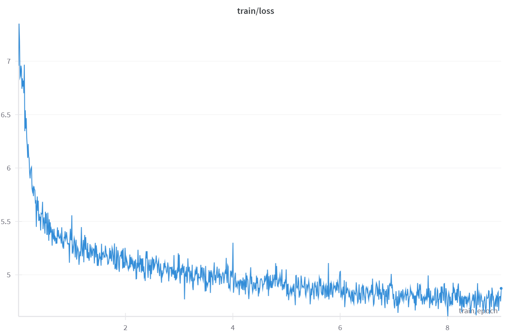
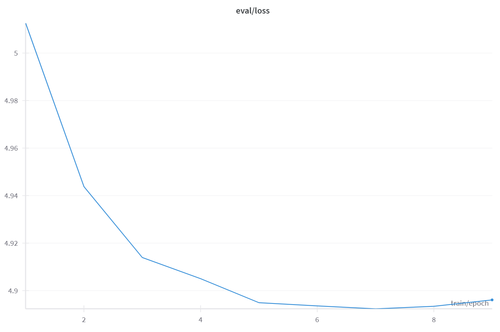

# Reddit User Mimic Bot

Reddit User Mimic Bot is an end-to-end Python project that fine‑tunes a BART model with LoRA adapters on a scraped Reddit question‑answer dataset (4446 examples). The repository provides scripts and source code for data collection, training, and inference, along with a simple Gradio app for demo purposes. The final output is a model you can ask a question to which it responds with an answer similar to comments scraped on Reddit (please read subsection [Example Outputs](README.md#example-outputs) for notes and reviews).

## Features
- **LoRA Training** – fine-tune `facebook/bart-base` using Low-Rank Adaptation on scraped Reddit Q&A data.
- **Data Pipeline** – scripts to scrape Reddit posts with filters for gathering better quality data, preprocess them, split into train/validation/test sets, tokenize and reformat.
- **Hugging Face Integration** – optional model upload to the Hugging Face Hub.
- **Logging and Experiment Tracking** – train/loss, val/loss tracked via Weights & Biases.
- **Model Efficiency** – utilize early stopping and Scaled Dot-Product Attention (SDPA) to optimize training efficiency and manage compute resources effectively.
- **Hyperparameter Sweeps** – configure and launch hyperparameter sweeps on Weights & Biases for systematic experiment management.
- **Inference Utilities** – command-line interface for evaluation on test set and text generation on user input.
- **Gradio Demo** – ready-to-deploy web app for interactive predictions. Hosted on [Huggingface Spaces](https://huggingface.co/spaces/codinglabsong/Reddit-User-Mimic-Bot).
- **Reproducible Workflows** – configuration-based training scripts and environment variables. Seed set during training.
- **Developer Tools** – linting with ruff and black, plus basic unit tests.

> You can also read about this project on my blog!
> - [Part 1: Data Scraping, Preprocessing, Tokenization](https://codinglabsong.medium.com/reddit-user-mimic-bot-with-bart-lora-part-1-data-scraping-preprocessing-and-tokenization-e9f3fb0b64a2)
> - [Part 2: Train, Sweep, Review Results](https://codinglabsong.medium.com/reddit-user-mimic-bot-with-bart-lora-part-2-train-sweep-review-results-5b2acaea322c)

## Installation

1. Clone this repository and install the core dependencies:
    ```bash
    pip install -r requirements.txt
    ```

2. (Optional) Install development tools for linting and testing:
    ```bash
    pip install -r requirements-dev.txt
    pre-commit install
    ```

3. Install the package itself (runs `setup.py`):

    ```bash
    # Standard install:
    pip install .

    # Or editable/development install:
    pip install -e .
    ```

4. Provide the required environment variables for Hugging Face,Weights & Biases, and Reddit API (if you want to scrape reddit for data). You can create a `.env` file from the supplied example:

    ```bash
    cp .env.example .env
    # then edit HUGGINGFACE_TOKEN and WANDB_API_KEY
    ```

## Data

The dataset consists of question‑answer pairs scraped from multiple subreddits. Use the helper script to download and preprocess the data:

```bash
python scripts/download_data.py --config data/subreddit_size_map.json
```

If you want to create a sample dataset from the training set created above, you can then run:

```bash
# create a sample dataset with 500 random examples
python scripts/sample_data.py --n 500
```

## Training

Use the wrapper script to launch training with your preferred hyper‑parameters:

```bash
# add `--train_sample True` to train on sample dataset
bash scripts/run_train.sh --num_train_epochs 4 --learning_rate 3e-5
```

Additional options are documented via:

```bash
python -m bart_reddit_lora.train --help
```

Checkpoints are stored in the directory specified by `--output_dir`. Set `--push_to_hub` and `--hf_hub_repo_id` to upload to the Hugging Face Hub.

## Inference

Evaluate the model on the test split or generate answers for custom prompts:

```bash
bash scripts/run_inference.sh --mode test
```

For custom prompts:

```bash
bash scripts/run_inference.sh --mode predict --texts "What do you think about politics right now?"
```

## Results





| Metric | Value |
| ------ | ----- |
| Loss | *3.8214* |

These results are on the test set with early stopping for 2 epochs.

You can download this checkpoint model on [Releases](https://github.com/codinglabsong/bart-reddit-lora/releases/tag/v1.0.0).


### Example Outputs

```bash
INFO:__main__:Input: What do you think about politics right now?
Output: I'm not sure what to think about it, but I think it's a good question. If you're interested in the politics of the future, I think you'll find a lot of interesting things to look at. I don't know if I've ever heard of a political party that hasn't done something like this before, but it's interesting to see how they've evolved over the past few years.
```

Generally speaking, questions that are broad in the realm of politics, science, economics, or history like above had better outputs. Due to the nature of this project of using a small dataset of 4446 examples and lower end bart-base model, it was difficult to create quality outputs for more specific questions that need factually correct answers. Here is an example on when the model tries to mimic reddit answers for more specific questions, but struggles in terms of coherence and factually correct information.

```bash
INFO:__main__:Input: Why does earth rotate?
Output: There are a number of reasons why the Earth rotates. One of them is that the earth's rotation is proportional to the speed of light. If you look at the diagram above, you can see that the Earth is rotating faster than the sun, which is why the sun doesn't rotate as fast as the sun.
```

Another limitation with this model is that it has difficulty with numbers, but that was partially expected given the size of data and model capacity:

```bash
INFO:__main__:Input: How could we improve the US economy?
Output: If you look at the US economy as a whole, you'll see that there are a lot of things that could be done to improve the economy. For example, if you looked at the GDP per capita in the US, you'd see that it's about $1.5 trillion, which is about $2.4 trillion. That's a lot more than you'd expect for a country like the US to be able to afford to spend $1 billion a year on goods and services. If we were to spend that much on infrastructure, we'd need to spend more on education and healthcare.
```

In conclusion, there was a lot to learn regarding the end-to-end process from messy online data to a more organized Q/A model. The model could certainly be improved with better computing resources, model architecture, and time.

### Considerations for Improvements

This project intentionally focused more on the methods and pipeline than the actual results. In the case you have more time and resources to improve the model, good points to start are...

- Increase the dataset size by scraping or adding high quality Q/A data.
- Upgrade the model architecture to Bart-Large.
- Increase the LoRA rank (r).
- Train for more epochs.
- Use a better evaluation metric like RougeL for early stopping.

## Data Preprocessing

1. **Subreddit Selection**  
   - Chosen subreddits: `r/askscience`, `r/AskHistorians`, `r/ExplainLikeImFive`, `r/AskPhysics`, `r/AskSocialScience`, `r/AskDocs`, `r/AskBiology`, `r/AskEconomics`
   - Dataset size: 4446 examples
   - Reasoning: There was high volume of general-interest Q&A, high-quality natural science or social science topics, good language quality across diverse communities. Quality of data had more weight in selecting subreddits rather than a specific domain of focus, as quality data was needed to get better results within a small training round. Diverse subreddits were chosen to prevent the model having a restrictive tone or style.

2. **Post & Comment Filters**  
    - **Post-level exclusions**  
        - Skip any non-self posts, link/image posts, removed content, cross-posts, locked threads, stickied or mod-distinguished posts, and “over 18” content.  
        - Discard posts by `AutoModerator` or with link flairs in `{"announcement","meta","megathread"}`.  
        - Require `score ≥ 2` and `upvote_ratio ≥ 0.90`.  
        - De-duplicate by title (case-insensitive), and ensure the combined title+body has ≥ 6 words.  
    - **Comment-level exclusions**  
        - Ignore stickied or mod-distinguished comments, any by `AutoModerator`, or comments from the same author as the post.  
        - Require comment `score ≥ 2` and ≥ 30 words.  
    - **Top-comment selection**  
        - Replace “more” comments, then pick the comment maximizing  
        `quality = score * (word_count ** 0.3)`  
        to avoid very short or joke-style replies.
    - **Duplication Prevention**
        - Drop duplicate Q–A pairs.

3. **Text Cleaning**
   - Strip HTML/Markdown tags using a parser (BeautifulSoup).  
   - Remove fenced code blocks matching ```…```.  
   - Eliminate URLs (`http://` or `https://`) and colon-wrapped emoji codes (e.g. `:smile:`).  
   - Collapse quoted lines beginning with `>` (including multi-line quotes).  
   - Remove bot signature footers matching `*I am a bot…*`.  
   - Replace any sequence of whitespace (spaces, newlines, tabs) with a single space, and trim leading/trailing spaces.  

4. **Train/Val/Test Split**  
   - 80% train, 10% validation, 10% test.
   - Save raw dataset, and then create separate CSV files for train, validation, and test.

## Running the Gradio Inference App
This project includes an interactive Gradio app for making predictions with the trained model.

1. **Obtain the Trained Model:**
    - Ensure that a trained model directory (e.g., `outputs/bart-base-reddit-lora/`) is available in the project root.
    - If you trained the model yourself, it should be saved automatically in the project root.
    - Otherwise, you can download it from [Releases](https://github.com/codinglabsong/bart-reddit-lora/releases/tag/v1.0.0) and add it in the project root.

2. **Run the App Locally:**
    ```bash
    python app.py
    ```
    - Visit the printed URL (e.g., `http://127.0.0.1:7860`) to interact with the model.

> You can also access the hosted demo on [Huggingface Spaces](https://huggingface.co/spaces/codinglabsong/Reddit-User-Mimic-Bot)

## Testing

Run unit tests with:

```bash
pytest
```

## Hyperparameter Exploration
For systematic hyperparameter exploration, you can use W&B sweeps:

1. Enter your Weights & Biases account entity in sweep.yaml on project root:
    ```yaml
    entity: your-wandb-username
    ```

2. Start a new sweep:
    ```bash
    # registers sweep config on the W&B backend (one-time)
    wandb sweep sweep.yaml

    # terminal prints:  Sweep ID: 3k1xg8wq
    # start an agent
    wandb agent <ENTITY>/<PROJECT>/<SWEEP-ID>
    ```

## Repository Structure

- `src/bart_reddit_lora/` – core modules (`train.py`, `inference.py`, etc.)
- `scripts/` – helper scripts for data, training, and inference
- `notebooks/` – Jupyter notebooks for exploration
- `data/` – dataset utilities and configuration
- `tests/` – simple unit tests

## Requirements

- Python >= 3.10
- PyTorch >= 2.6
- Other dependencies listed in `requirements.txt`

## Contributing

Contributions are welcome! Feel free to open issues or submit pull requests.

## Acknowledgements
- [facebook/bart-base](https://huggingface.co/facebook/bart-base)
- [Huggingface LoRA Docs](https://huggingface.co/docs/peft)

## License

This project is licensed under the [MIT License](LICENSE).
